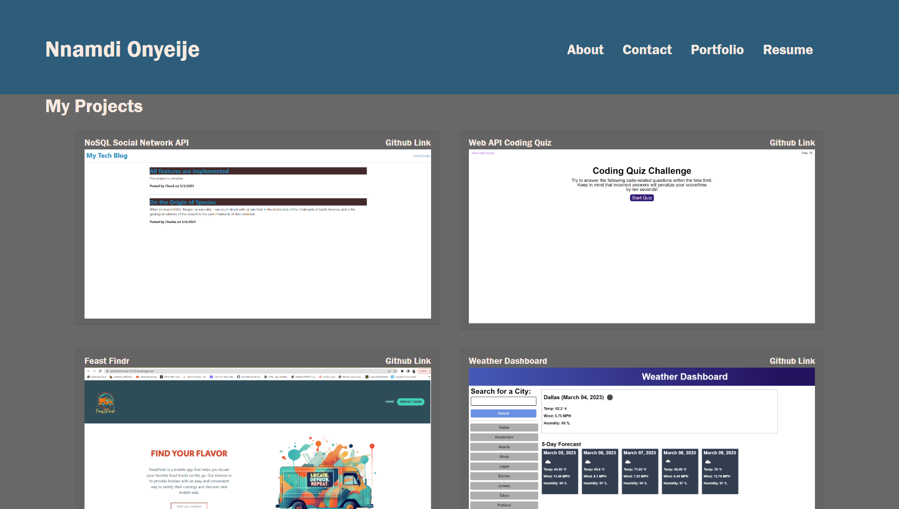

# React-Web-Development-Portfolio

## Description

This project is web development portfolio created using React.

## Table of Contents

- [Screenshots](#screenshots)

- [Usage](#usage)

- [License](#license)

- [Contributing](#contributing)

- [Questions](#questions)

- [Website-Link](#website-link)

## Screenshots

## Usage

Users can click on the navigation links in the header to browse different parts of the portfolio. On the contact page they can send their information, and on the resume page they can download a copy of Nnamdi's resume.

## License

The license being used for this application is the MIT license.

## Contributing

N/A

## Website Link

https://nnamdionyeije.github.io/React-Web-Development-Portfolio/

## Questions

If you have any questions feel free to reach out to me at my email nnamdionyeije@gmail.com or through my GitHub at [https://github.com/nnamdionyeije](https://github.com/nnamdionyeije/).
